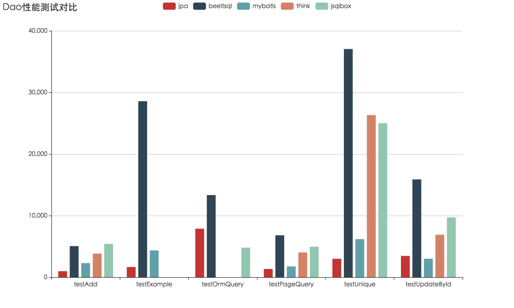

# JLAB by baijigan 2020

#### 项目介绍
dao 性能测试，包含jpa，mybatis，beetlsql等Dao工具，测试了插入，修改，查询，翻页查询，orm查询等常用操作性能，以此来优化BeetlSQL性能

#### 运行本例子

* git clone https://github.com/baijigan/jlab.git

* mvn clean package

* java -jar -Dtest.target=jdbc  target/dao-0.0.1-SNAPSHOT.jar

* 测试目标可更换为jpa,beetlsql,mybatis,jdbc,think,anima,jsqlbox

* 在result目录检测测试文本结果

* 运行 java -jar   target/dao-0.0.1-SNAPSHOT.jar beetlsql jsqlbox  mybatis jpa  可以弹出浏览器，通过echart显示性能对比.参数可以是任意测试目标组合。或者参数用all，则比较所有的dao工具性能


#### 测试过程说明
为了减少数据库对Dao测试带来影响，采用H2内存数据库，如下配置


```yml
spring:
    datasource:
        driver-class-name: org.h2.Driver
        password: ''
        schema: classpath:db/schema.sql
        url: jdbc:h2:mem:dbtest;DB_CLOSE_ON_EXIT=FALSE
        username: sa
test:
    count: 1000
    target: beetlsql
    warmCount: 20

mybatis-plus:
  #实体扫描，多个package用逗号或者分号分隔
  typeAliasesPackage: com.ibeetl.dao.mybatis.entity

beetl:
    suffix: html
beetl-beetlsql:
    dev: false
beetlsql:
    ds:
        datasource:
            basePackage: com.ibeetl.dao.beetlsql
    mutiple:
        datasource: datasource 
```

BeanchmarkApplication 是程序入口，启动后即可做测试，或者打开浏览器，用echart输出性能测试结果

```java
@Bean
public CommandLineRunner commandLineRunner(ApplicationContext ctx) {
	return args -> {
		if (args.length==0) {
			test(warmCount, false);
			test(testCount, true);
			logFile(target);
			// 测试完后退出
			System.exit(0);
		} else {
			// 打开浏览器显示性能对比
			openExplore(args);
		}
	};
}
```

可以设定预热次数，以及是否记录日志。

测试完毕，自动打印每个测试的方法并记录到文件系统里,位于程序运行的result目录，每个文件内容如下

```
#jdbc,total=1000 tps:
#Sun Jun 17 19:22:01 CST 2018
testAdd=8695
testExample=0
testOrmQuery=0
testPageQuery=18181
testUpdateById=15873
testUnique=142857
```

> 结果为0的表示Dao工具不具备此功能


#### 测试场景

* testAdd： 向数据库插入一条用户记录
* testUpdateById  根据主键更新以一条用户记录
* testPageQuery  翻页查询
* testUnique 根据主键查询用户记录
* testExample 模板类查询
* testOne2Many  关系映射测试，选择Customer 和 Order 来做专门的关系映射性能测试

#### 增加新的Dao

参考TestServiceConfig，提供一个TestServiceInterface接口实现

```java
@Configuration
public class DataSourceConfig {
	
	
	@Bean
	@ConditionalOnProperty(name = "test.target", havingValue = "beetlsql")
	public TestServiceInterface getBeetlSqlTestService() {
		return new BeetlSqlPerformaceTestService();
	}
	@Bean
	@ConditionalOnProperty(name = "test.target", havingValue = "jpa")
	public TestServiceInterface getJpaTestService() {
		return new JpaPerformaceTestService();
	}


}
```

#### 测试截图



> jdbc 作为基准，性能是最好的，不在列出，有兴趣可以自己测试jdbc并输出测试结果
> 国内有些Dao并没有经过作者本人许可下不会贴出性能测试结果。如果有兴趣自己测试并输出测试结果

#### 测试结果说明

测试结果，JDBC遥遥领先，BeetlSQL 是紧随其后，勉强能跟得上JDBC.对于全功能Dao框架来说，BeetlSQL表现无疑是最好的.


#### TODO

* EBean测试

* EclipseLink 作为JPA实现测试

* 纯MyBatis测试，尽管现实中很少单纯使用MyBatis，但有些人还是希望纯MyBatis再测试一次

* JOOQ测试

  

